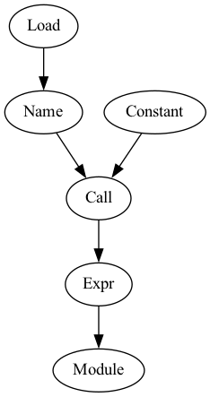

# How-Cpython-Works
This aims to help Python developers gain a deeper understanding of the inner workings of CPython, which can aid in writing more efficient and optimized Python code.

## 0. Define an evaluand
We're going to define the function printing out "Hello, world!" and set it to an evaluand for the sake of simplicity.

## 1. Lexical Analysys
Lexical analysis is the first phase in the compiler designing which groups a stream of letters or sounds into sets of units that represent meaningful syntax.
```
❯ python lexical_analysis.py
```
<details><summary>Output</summary>

```rb
[TokenInfo(type=62 (ENCODING), string='utf-8', start=(0, 0), end=(0, 0), line=''),
TokenInfo(type=1 (NAME), string='print', start=(1, 0), end=(1, 5), line='print("Hello, world!")'),
TokenInfo(type=54 (OP), string='(', start=(1, 5), end=(1, 6), line='print("Hello, world!")'),
TokenInfo(type=3 (STRING), string='"Hello, world!"', start=(1, 6), end=(1, 21), line='print("Hello, world!")'),
TokenInfo(type=54 (OP), string=')', start=(1, 21), end=(1, 22), line='print("Hello, world!")'),
TokenInfo(type=4 (NEWLINE), string='', start=(1, 22), end=(1, 23), line=''),
TokenInfo(type=0 (ENDMARKER), string='', start=(2, 0), end=(2, 0), line='')]
```
</details>
<br>

## 2. Syntax Analysis
Syntax analysis is the second phase in compiler designing in which the given input string is checked for the confirmation of rules and structure of the formal grammar.
```
❯ python syntax_analysis_readable.py
```
<details><summary>Output</summary>

```rb
<class 'ast.Module'>
    <class 'ast.Expr'>: 1
        <class 'ast.Call'>: 1
            <class 'ast.Name'>: 1
                <class 'ast.Load'>
            <class 'ast.Constant'>: 1
```
</details>
<br>
If you want it to be visualized, you can try the following.

```
❯ brew install graphviz
❯ pip install graphviz
❯ python syntax_analysis_visualizable.py
```
You'll see ast.png saved.



<br>

## 3. Bytecode
Bytecode is computer object code that an interpreter converts into binary machine code which is created based on the result of syntax analysis.
```
❯ python bytecode.py
```
<details><summary>Output</summary>

```rb
              0 LOAD_GLOBAL              0 (print)
              2 LOAD_CONST               1 ('Hello, world!')
              4 CALL_FUNCTION            1
              6 POP_TOP
              8 LOAD_CONST               0 (None)
             10 RETURN_VALUE
```
</details>
<br>

## 4. Interpretation and execution by PVM
Bytecode is interpreted and executed by PVM.
If you want to know how interpretation performs, look through <a href="https://github.com/python/cpython/blob/main/Python/ceval.c">ceval.c</a>. During a Python function call, Python will call an evaluating C function to interpret that function's code, according to <a href="https://docs.python.org/ja/3.11/whatsnew/3.11.html#inlined-python-function-calls">the official documentation</a>.


## Your Python code runs fast?
Bytecode helps think about an effect on runtime. In this case, we compare two functions creating the list that contains multiples of 3 between 1 and 1000. 
```
def multiplier():
    list = []
    for i in range (1, 1000):
        if i%3 == 0:
            list.append (i)

def multiplierByListComprehension():
    list = [i for i in range (1, 1000) if i%3 == 0]
```

```
❯ python comparison.py
```
<details><summary>Output</summary>

```rb
              0 BUILD_LIST               0
              2 STORE_FAST               0 (L)
              4 LOAD_GLOBAL              0 (range)
              6 LOAD_CONST               1 (1)
              8 LOAD_CONST               2 (1000)
             10 CALL_FUNCTION            2
             12 GET_ITER
             14 FOR_ITER                13 (to 42)
             16 STORE_FAST               1 (i)
             18 LOAD_FAST                1 (i)
             20 LOAD_CONST               3 (3)
             22 BINARY_MODULO
             24 LOAD_CONST               4 (0)
             26 COMPARE_OP               2 (==)
             28 POP_JUMP_IF_FALSE       20 (to 40)
             30 LOAD_FAST                0 (L)
             32 LOAD_METHOD              1 (append)
             34 LOAD_FAST                1 (i)
             36 CALL_METHOD              1
             38 POP_TOP
             40 JUMP_ABSOLUTE            7 (to 14)
             42 LOAD_CONST               0 (None)
             44 RETURN_VALUE

elapsed time: 0.000077248 [sec]

              0 LOAD_CONST               1 (<code object <listcomp> at 0x10b3294d0, file "/Users/iamstgt/How_CPython_Works/comparison.py", line 25>)
              2 LOAD_CONST               2 ('multiplierByListComprehension.<locals>.<listcomp>')
              4 MAKE_FUNCTION            0
              6 LOAD_GLOBAL              0 (range)
              8 LOAD_CONST               3 (1)
             10 LOAD_CONST               4 (1000)
             12 CALL_FUNCTION            2
             14 GET_ITER
             16 CALL_FUNCTION            1
             18 STORE_FAST               0 (L)
             20 LOAD_CONST               0 (None)
             22 RETURN_VALUE
Disassembly of <code object <listcomp> at 0x10b3294d0, file "/Users/iamstgt/How_CPython_Works/comparison.py", line 25>:
              0 BUILD_LIST               0
              2 LOAD_FAST                0 (.0)
              4 FOR_ITER                10 (to 26)
              6 STORE_FAST               1 (i)
              8 LOAD_FAST                1 (i)
             10 LOAD_CONST               0 (3)
             12 BINARY_MODULO
             14 LOAD_CONST               1 (0)
             16 COMPARE_OP               2 (==)
             18 POP_JUMP_IF_FALSE        2 (to 4)
             20 LOAD_FAST                1 (i)
             22 LIST_APPEND              2
             24 JUMP_ABSOLUTE            2 (to 4)
             26 RETURN_VALUE

elapsed time: 0.000056982 [sec]
```
</details>
<br>
As you can see, a list comprehension is faster than using an append method. Wanna try your own code?
